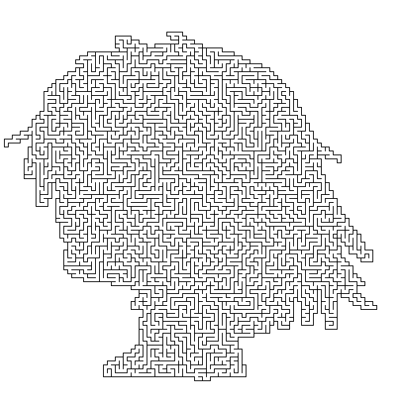

# Maze-Generation
Maze generation using various algorithms, with the Pygame library in python to draw and export maze images. 

- This is a simple showcase of what I have learned from the book [*Mazes for Programmers*](http://www.mazesforprogrammers.com/). The examples in the book were written in Ruby, but since I wanted to improve my Python programming skills, I chose to code along and translate them into python.

## Dependencies: 
- Pygame, Numpy, random, math.

## Different Maze-Generating Algorithms:
- Includes Python implementations and demos of the following algorithms: **binary tree**, **side winder**, **Aldous Broder**, **Wilsons**, **hunt-and-kill**, and **recursive backtracker**.
- While there are plentiful choices of algorithms, for the showcasing of different types of mazes, I use **recursive backtracker** by default. Switching to other algorithms can be easily made by changing the demo files. See details below.

## Four Types of Mazes:
Includes 4 types of mazes generated by recursive backtracker: 
- **Simple rectangular mazes**
  - Use "RecursiveBacktrackerDemo.py".
  - Generates a simple rectangular grid maze with m by n grid cells (currently set to 20 by 20).
  - Change the dimension of the grid, cell size, or the output file path in the python file.
  - *Note:* There are 2 equivalent methods in the Recursive Backtracker class: `.on(grid)` and `.onRecursion(grid, startingCell)`. As suggested by their names, the first function declares an explicit stack (list) to keep track of the cells and starts at a random cell, while the second one is a recursive function and hence requires a starting cell to be passed. Please use the first method when generating large mazes as Python has a recursion depth limit of 1000. 

- **Colored rectangular mazes** 
  - Use "RecursiveBacktrackerColored.py".
  - Generates a simple rectangular grid maze (currently set to 100 by 100) with a colored grid (currently set to shades of purple). The coloring of each cell is based on the number of steps from the starting cell, generated by a simplified Dijkstra's algorithm (breadth first). The starting cell is set to the center cell of the grid.
  - Change the dimension of the grid, cell size, the starting cell, or the output file path in the python file. 
  - Change the coloring in the return of the `ColoredGrid.backgroundColorFor(cell)` method.

- **Circular mazes**
  - Use "CircleMaze.py".
  - Generates a circle-shaped polar grid maze with a radius of n cells (currently set to 20).
  - Change the radius of the polar gird, cell size, or the output file path in the python file.

- **Mazes based on mask image inputs**
  - Use "MaskImage.py".
  - Takes in an image, produces a mask, and uses this mask to generate a maze. The program regards any black pixels in the input image as unwanted; in other words, the mask will be only the non-black area of the image. See an example below:

Input Image:   ->  Output maze: 
  - *Note:* The non-black area of the input image must be continuous, or the maze generation algorithm will not work.
  - Change the input file path, cell size, or the output file path in the python file.
